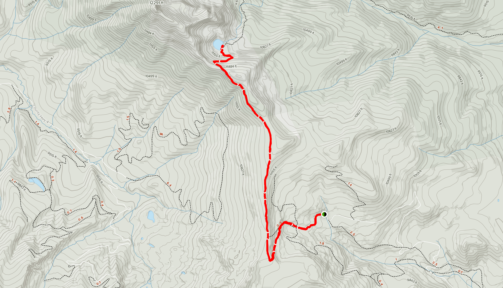

# July 5-7th, 2020 - [Blue Ridge Trail to Bowen Lake](https://www.alltrails.com/trail/us/colorado/blue-ridge-trail-to-bowen-lake--2)
- Trail head: 40.30017,-105.91991
- Destination: 40.330855, -105.945275
- Distance: 9.3 Miles Round Trip
- Elevation Gain: 1,906 Feet
- [Driving Directions](https://www.google.com/maps/dir/Falcon,+El+Paso+County,+CO/40.30017,-105.91991/@39.6924383,-106.0515612,217380m/data=!3m2!1e3!4b1!4m12!4m11!1m5!1m1!1s0x871333c80a0d9aa9:0x490cfece10bcb684!2m2!1d-104.6009415!2d38.9383017!1m0!2m3!6e0!7e2!8j1593925200)

## Meals

### Sunday
- Lunch - BYO
- Dinner - Kev - Red Lentil Marinara

### Monday
- Breakfast - Trey
- Lunch - Kev - Coconut Curry Ramen
- Dinner - Trey

### Tuesday
- Breakfast - Kev - Apple Quinoa Porridge
- Lunch - Trey

## Schedule

### Sunday 5th
- (5:00am) Leave Falcon, CO
- (8:30am) Arrive at trail head
- (10:30am) Arrive at lake

### Monday 6th

### Tuesday 7th
- (9:00am) Start hike back
- (11:00am) Back at trail head
- (12:00pm) Leave for home
- (3:30pm) Arrive at home

