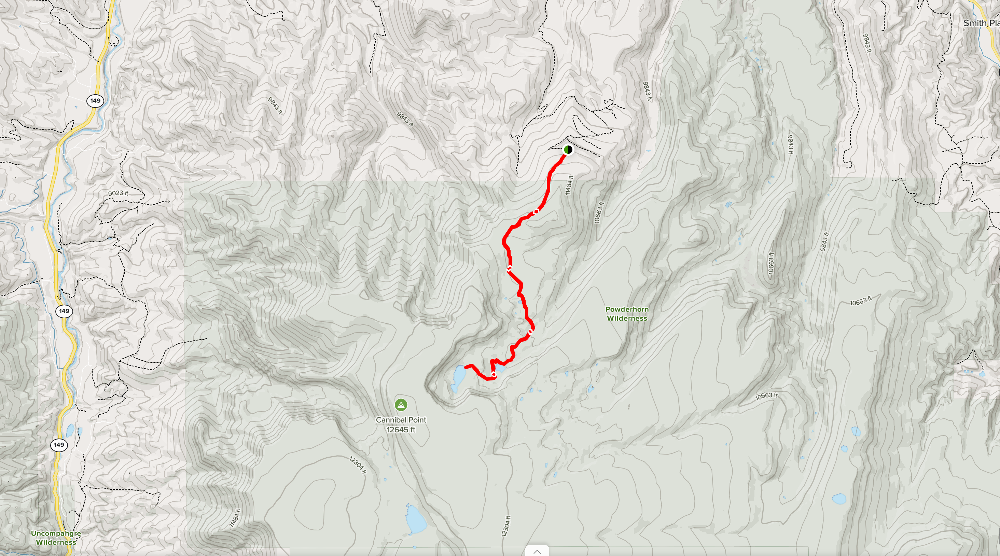

# August 29-31st, 2020 - [Powderhorn Lakes](https://www.alltrails.com/trail/us/colorado/powderhorn-lakes--2)
- Trail head: 38.176861, -107.164671
- Destination: 38.133467, -107.190888
- Distance: 9.4 Miles Round Trip
- Elevation Gain: 1,679 Feet
- [Driving Directions](https://www.google.com/maps/dir/508+Pluto+Drive,+Colorado+Springs,+CO/38.17678,-107.16505/@38.8211372,-106.5511684,9z/data=!3m1!4b1!4m12!4m11!1m5!1m1!1s0x87135ae08b43feab:0xad8f3149cc2364bd!2m2!1d-104.8702037!2d38.8218328!1m0!2m3!6e0!7e2!8j1598682600)

## Meals

### Saturday
- Lunch - [Vegetarian Lentil Chili](https://www.rei.com/blog/camp/backpacking-vegetarian-lentil-chili-recipe)
- Dinner  - [Red Lentil Marinara](https://www.rei.com/blog/camp/backpacking-recipes-red-lentil-marinara)

### Sunday
- Breakfast - Oatmeal Packets
- Lunch - [Coconut Curry Ramen](https://www.rei.com/blog/camp/backpacking-recipe-coconut-curry-ramen)
- Dinner - [Fried Rice](https://www.rei.com/blog/camp/backpacking-recipe-fried-rice)

### Monday
- Breakfast - Oatmeal Packets
- Lunch - Bars

## Schedule

### Saturday
- (5:45am) Breakfast @ Trey's
- (6:15am) Repack
- (6:30am) Depart Colorado Springs
- (11:00am) Arrive at trail head
- (1:30pm) Arrive at lake

### Sunday

### Monday
- (9:00am) Start hike back
- (11:30am) Back at trail head
- (4:00pm) Arrive at home

